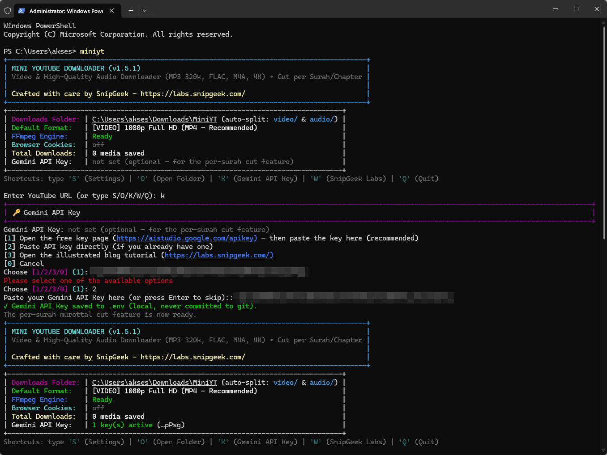
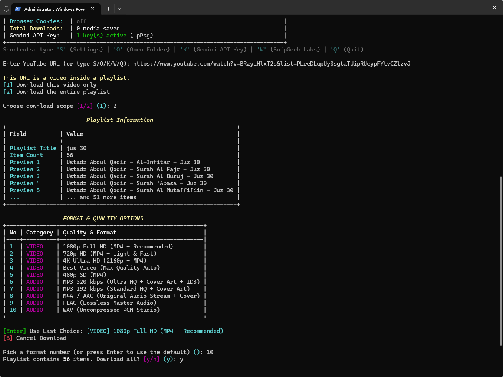
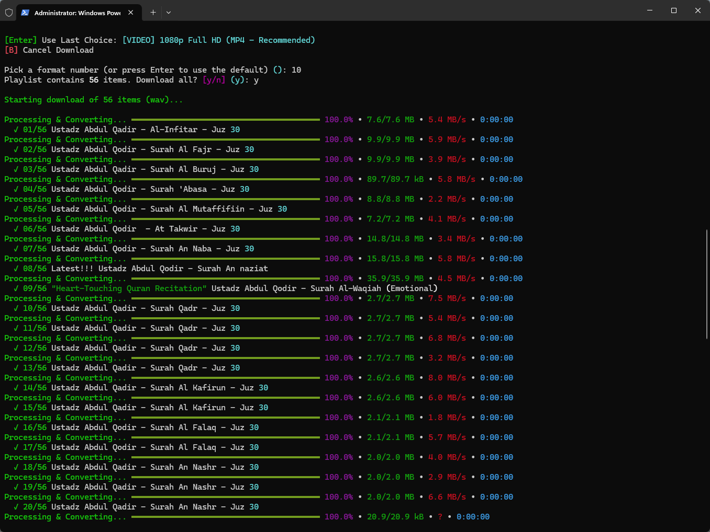
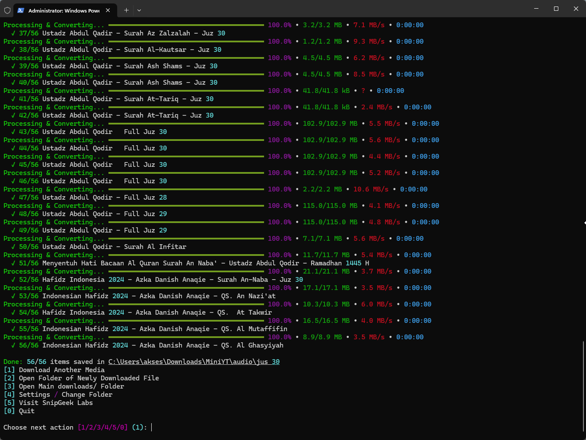

# ⚡ Mini YouTube Downloader (v1.5.1)

Aplikasi downloader YouTube & konverter audio mandiri, super ringan, dan ramah pemula untuk Windows.
*Crafted with ❤️ by [SnipGeek](https://labs.snipgeek.com/)*

🌐 **English: [README.md](README.md)**

---

## 🚀 Install (Online, Satu Perintah)

Buka **PowerShell** lalu jalankan:

```powershell
irm https://raw.githubusercontent.com/ieproject-app/mini-YT-Downloader/main/install.ps1 | iex
```

Installer akan:
1. Mengecek/memastikan prasyarat Python
2. Mengunduh aplikasi ke `%LOCALAPPDATA%\MiniYT\app`
3. Membuat environment Python terisolasi + memasang dependensi
4. Mendaftarkan perintah **`miniyt`** (bisa dipanggil dari terminal mana pun)
5. FFmpeg (~160MB) otomatis terunduh saat pertama kali app dijalankan

Setelah itu cukup ketik di mana saja:

```text
miniyt
```

> Lebih suka cara klasik? Download repo ini lalu klik ganda **`run.bat`**
> (mode portable — semua data tetap di dalam folder repo).

## 🔄 Update

Aplikasi mengecek GitHub (maks 1x per 24 jam). Bila ada versi baru, app
menampilkan **apa yang berubah** (changelog) dan menawarkan update satu
ketukan — app menutup, updater berjalan di background, lalu Anda jalankan
`miniyt` lagi.

- Cek manual kapan saja: `miniyt update`, atau Settings → **[8] Cek Update**
- Matikan auto-check: set `"check_updates": false` di `config.json` aplikasi
- Semua rilis & changelog: [halaman Releases](https://github.com/ieproject-app/mini-YT-Downloader/releases)

> **Catatan Pengguna Baru**:
> - Python **3.9+** harus terinstall dengan centang *"Add Python to PATH"*.
> - FFmpeg (~90MB) diunduh otomatis saat pertama kali dijalankan.

---

## 📸 Screenshot

<table>
  <tr>
    <td align="center" width="50%">
      <a href="screenshots/01-first-run-gemini-key-setup.png"></a><br>
      <sub><b>Pertama kali — paste Gemini API key langsung di jembatan K</b></sub>
    </td>
    <td align="center" width="50%">
      <a href="screenshots/02-key-installed-ready.png"></a><br>
      <sub><b>Key terpasang — fitur potong per surah siap</b></sub>
    </td>
  </tr>
  <tr>
    <td align="center">
      <a href="screenshots/03-playlist-download-progress.png"></a><br>
      <sub><b>Unduhan playlist berjalan (56/56 item)</b></sub>
    </td>
    <td align="center">
      <a href="screenshots/04-playlist-download-complete.png"></a><br>
      <sub><b>Selesai — semua item tersimpan rapi</b></sub>
    </td>
  </tr>
</table>

*Klik screenshot untuk melihat ukuran penuh.*

---

## 🔑 Gemini API Key (Opsional)

Fitur **✂️ Potong per Surah/Chapter (murottal Juz Amma)** memakai
[Google Gemini](https://deepmind.google/technologies/gemini/) untuk mendeteksi
batas surah — baik verifikasi surah yang "hilang timestamp" pada video
ber-chapter, maupun deteksi **penuh dari audio** untuk video murottal tanpa
chapter.

**Tanpa API key, aplikasi tetap 100% normal** — semua fitur unduh
video/audio/playlist berjalan seperti biasa. Key **hanya** dipakai saat Anda
memilih opsi potong per surah.

### Cara mendapatkan API key (gratis, free tier)
1. Buka **https://aistudio.google.com/apikey** dan login dengan akun Google.
2. Klik **"Create API key"** → pilih project (atau biarkan default) → key muncul.
3. Klik **Copy** untuk menyalin key (formatnya mirip `AIzaSy...`).

### Cara memasukkan key ke aplikasi
**Lewat menu (paling mudah):**
1. Jalankan `miniyt` (atau `run.bat`).
2. Saat pertama dibuka, aplikasi menawarkan memasang key. Anda juga bisa
   menekan **`K`** di halaman utama — app membuka halaman key gratis **lalu**
   langsung meminta paste key-nya (jembatan lengkap).
   Atau ketik `S` (Settings) → **[6] Gemini API Key** untuk menu yang sama.
3. Baris status menampilkan *"1 key aktif"* setelah key terpasang.

**Manual (opsional):** salin `.env.example` menjadi `.env` di samping aplikasi lalu isi:
```dotenv
GEMINI_API_KEYS=AIzaSy...
```
Anda boleh mengisi lebih dari satu key (dipisah koma) — aplikasi memakai
round-robin untuk menghindari batas kuota free tier.

### 🔒 Privasi & keamanan
- Key disimpan **lokal** di file `.env` — **tidak pernah di-upload**, tidak
  ikut ter-commit ke GitHub (diabaikan `.gitignore`), dan hanya dikirim
  langsung ke API Google Gemini.
- Jangan pernah membagikan key Anda ke orang lain.
- Kuota free tier Google bersifat harian & per-key. Bila muncul *quota
  exceeded*, tambahkan key baru atau tunggu keesokan harinya.

---

## 📁 Lokasi Hasil Unduhan

Hasil unduhan dipisahkan rapi di dalam folder downloads:
- 🎬 **Video (MP4 4K / 1080p / 720p)** → `video/`
- 🎵 **Audio (MP3 320k / M4A / FLAC)** → `audio/`
- 📃 **Playlist** → paste URL playlist, semua item masuk subfolder sesuai nama
  playlist (contoh: `audio/Nama Playlist/01 - Lagu.mp3`). Playlist >20 item
  muncul konfirmasi dulu. Item gagal otomatis dicoba ulang 3 strategi:
  jalur normal → client alternatif → format cadangan (kualitas lebih rendah).

Lokasi default:
- Mode ter-install: `%USERPROFILE%\Downloads\MiniYT`
- Mode portable: `<repo>\downloads`

---

## ✨ Fitur Unggulan

1. **Download Playlist 📃**: paste URL playlist, semua item otomatis diunduh ke subfolder sesuai nama playlist (MP3/M4A/FLAC/WAV/MP4).
2. **Kualitas Audio Maksimal (MP3 320 kbps)**: Cover Art Thumbnail & ID3 Metadata otomatis.
3. **Folder Management**: Menu 1-klik untuk membuka folder di Windows Explorer.
4. **Bypass Proteksi YouTube**: Ekstraksi metadata instan, anti-lag & anti-bot check.
5. **Potong per Chapter/Surah ✂️**: Video murottal Juz (ber-chapter ATAU tanpa chapter) bisa dipotong jadi **file MP3 per surah**. Butuh Gemini API key (free tier — lihat atas). Dua jalur:
   - **Ber-chapter**: chapter dari metadata; surah "hilang timestamp" diverifikasi via Gemini; Opening di-skip; output rapi `NN - Surah X.mp3`.
   - **Tanpa chapter**: transkripsi word-level (`gemini-3.5-transcribe`) memetakan kata bacaan ke batas surah secara presisi (37 surah Juz Amma terverifikasi saat pengujian); fallback ke sweep audio per-chunk. File sumber mentah otomatis dihapus setelah dipotong.
6. **UI Dwibahasa 🌐**: English & Bahasa Indonesia — ditanyakan sekali di first-run, bisa diganti kapan saja di Settings.

---

## ⚖️ Legal & Fair Use

- Tool ini **tidak berafiliasi dengan YouTube atau Google**. YouTube adalah
  merek dagang milik Google LLC.
- Unduh konten **hanya untuk penggunaan pribadi** atau jika Anda memiliki hak.
  Meng-upload ulang atau memonetisasi konten orang lain tanpa izin dapat
  melanggar hukum hak cipta dan Ketentuan Layanan YouTube.
- Anda bertanggung jawab atas cara penggunaan tool ini.

> 🔄 **Update aplikasi**: cukup jalankan ulang perintah install di atas —
> versi terbaru akan diunduh ulang, setelan Anda tetap aman.

---

## 🔁 Versi & Rollback

Proyek ini menggunakan Git tag sebagai titik aman:

- Lihat riwayat commit: `git log --oneline`
- Kembali ke versi stabil terakhir: `git checkout v1.4.1`
- Batalkan commit terakhir: `git revert HEAD`
- Lihat status file berubah: `git status`

---

## 🌐 Tentang Pengembang
Temukan berbagai tools produktivitas, template, dan artikel teknologi lainnya di:
🔗 **[https://labs.snipgeek.com/](https://labs.snipgeek.com/)**
